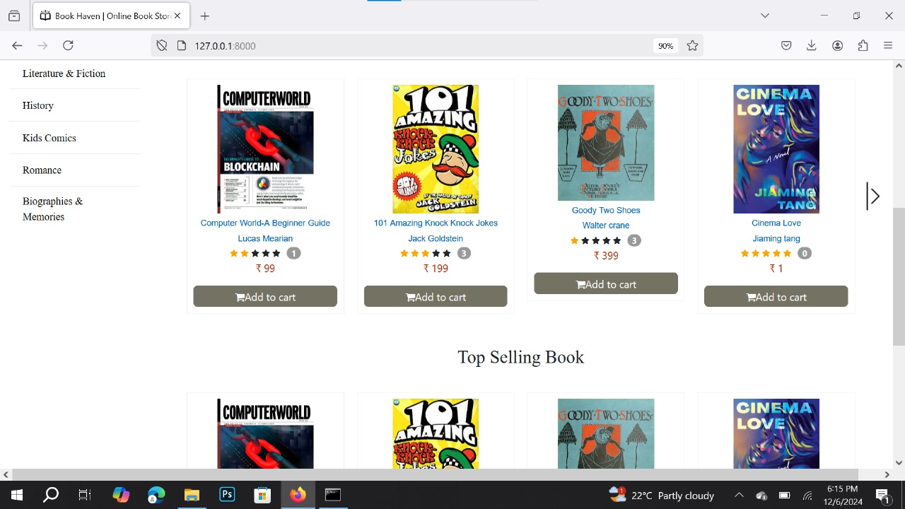
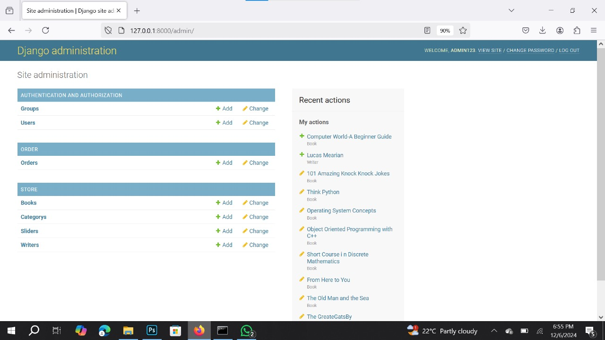

Online Book Store Project

Overview

This project is a fully functional Online Bookstore built using Python and Django. It enables customers to browse, search, and purchase books seamlessly. The system supports secure checkout, order tracking, and user reviews while providing an intuitive admin panel for inventory and sales management.

Features

User-Friendly Interface – Clean and responsive design for easy navigation.

Book Browsing & Search – Search books by title, author, or genre.

Filtering & Sorting – Users can filter books based on categories, price, and ratings.

Shopping Cart & Secure Checkout – Integrated payment options using PayPal, Stripe, and Razorpay.

Order Management – Users can track their orders, and admins can process them.

Reviews & Ratings – Customers can leave reviews and rate books.

Admin Dashboard – Manage inventory, orders, and customer details with ease.

Installation

To set up the project locally, follow these steps:

1. Clone the repository:

git clone https://github.com/your-username/Online-Book-Store-Project.git
cd Online-Book-Store-Project

2. Install dependencies:

pip install django
pip install django-cors-headers
pip install django-crispy-forms
pip install xhtml2pdf

3. Apply migrations:

python manage.py migrate

4. Run the development server:

python manage.py runserver

5. Open your browser and go to:

http://127.0.0.1:8000/

Screenshots

=======

Contributing

Contributions are welcome! Feel free to open issues or submit pull requests to improve the project.

License

This project is licensed under the MIT License. Feel free to modify and use it as needed.

Connect with Me

If you like this project, don’t forget to star the repository and follow me on GitHub!

