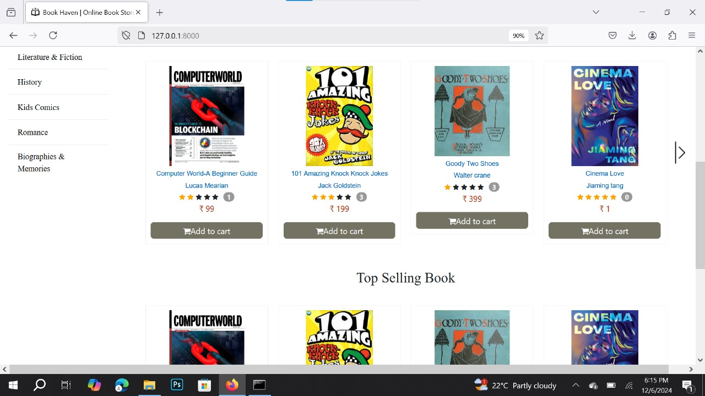
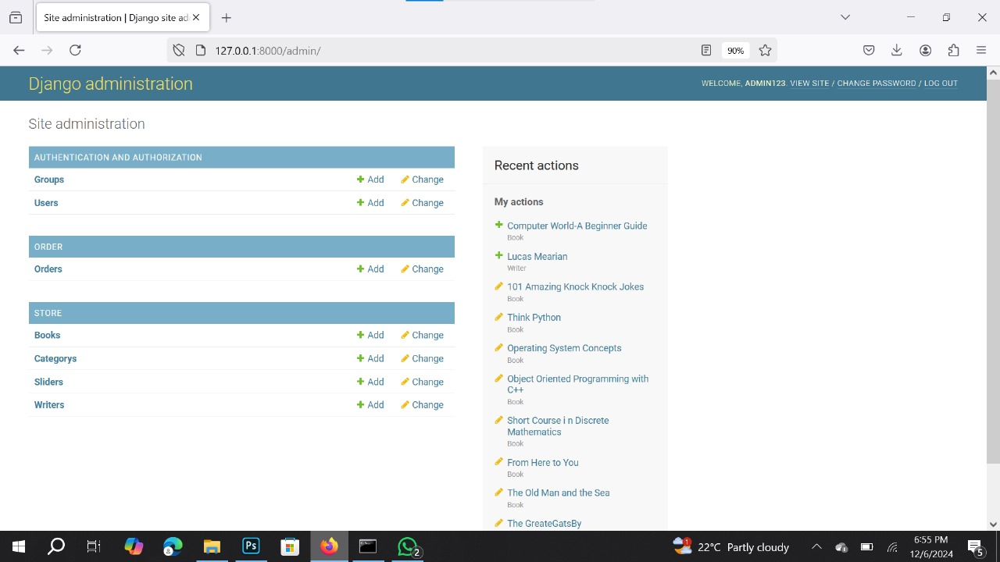

# Online Book Store Project

## Overview

This project is a fully functional Online Bookstore built using Python and Django. It enables customers to browse, search, and purchase books seamlessly. The system supports secure checkout, order tracking, and user reviews while providing an intuitive admin panel for inventory and sales management.

## Features

User-Friendly Interface – Clean and responsive design for easy navigation.
- Book Browsing & Search – Search books by title, author, or genre.
- Filtering & Sorting – Users can filter books based on categories, price, and ratings.
- Shopping Cart & Secure Checkout – Integrated payment options using PayPal, Stripe, and Razorpay.
- Order Management – Users can track their orders, and admins can process them.
- Reviews & Ratings – Customers can leave reviews and rate books.
- Admin Dashboard – Manage inventory, orders, and customer details with ease.

## Local Installation

1. Clone the repository:

```bash
   git clone https://github.com/your-username/Online-Book-Store-Project.git
   cd Online-Book-Store-Project
   ```

2. Install dependencies:
   
 ```bash
   pip install -r requirements.txt
   ```

3. Apply migrations:

   ```bash
   python manage.py migrate
   ```

4. Run the development server:

```bash
   python manage.py runserver
   ```

5. Open your browser at `http://127.0.0.1:8000`.

---

## Deployment Guide (Backend on Render + Frontend on Netlify)

> Important: this repository is currently a Django **server-rendered** app. That means pages are rendered by Django templates, not a dedicated React/Vue frontend app.
>
> If you want a strict split architecture (Netlify frontend + Render backend), you should expose backend API endpoints and maintain a separate frontend project. The steps below support both scenarios.
> 
### 1) Deploy Django backend on Render

This repository already contains a `render.yaml` blueprint. In Render:

1. Push this repository to GitHub.
2. In Render, choose **New +** → **Blueprint**.
3. Select this repo; Render will detect `render.yaml`.
4. Set/confirm these environment variables in Render service settings:
   - `SECRET_KEY` (auto-generated by Render if using blueprint)
   - `DEBUG=False`
   - `ALLOWED_HOSTS=<your-render-domain>`
   - `CSRF_TRUSTED_ORIGINS=https://<your-render-domain>,https://<your-netlify-domain>`
   - `CORS_ALLOWED_ORIGINS=https://<your-netlify-domain>`
   - `DATABASE_URL=<render-postgres-url>` (recommended for production)
5. Deploy and verify backend URL, e.g. `https://online-book-store-backend.onrender.com`.

### 2) Frontend deployment options

#### Option A (recommended for this codebase): Django templates only

Use Render only, and let Django serve frontend pages itself. Netlify is not required.

#### Option B (split frontend on Netlify)

Use Netlify only for a separate static/SPA frontend repo.

1. Create or use a frontend project (React/Vue/etc.) in a separate folder/repository.
2. Add environment variable in Netlify:
   - `VITE_API_BASE_URL=https://<your-render-domain>` (or similar based on framework).
3. Build and deploy that frontend to Netlify.
4. In backend Render env vars, include your Netlify domain in:
   - `CSRF_TRUSTED_ORIGINS`
   - `CORS_ALLOWED_ORIGINS`

### 3) Quick verification checklist

Backend health: open `https://<render-domain>/` and confirm no 500 error.
- Admin/static: check CSS loads correctly.
- Cross-origin requests: browser network tab should show successful API calls from Netlify domain.
- Django security: confirm `DEBUG=False` in production.

### 4) Common deployment fixes

- **403 CSRF Failed**: add exact Netlify URL to `CSRF_TRUSTED_ORIGINS`.
- **CORS blocked**: add exact Netlify URL to `CORS_ALLOWED_ORIGINS`.
- **Static files missing**: ensure `collectstatic` runs during Render build (already configured).
- **Database reset on deploy**: use Render Postgres and set `DATABASE_URL`.

---

## Screenshots





## Contributing

Contributions are welcome! Feel free to open issues or submit pull requests to improve the project.

## License

This project is licensed under the GNU General Public License (GPL). Feel free to modify and use it as needed.

## Connect with Me

If you like this project, don’t forget to star the repository and follow me on GitHub!
